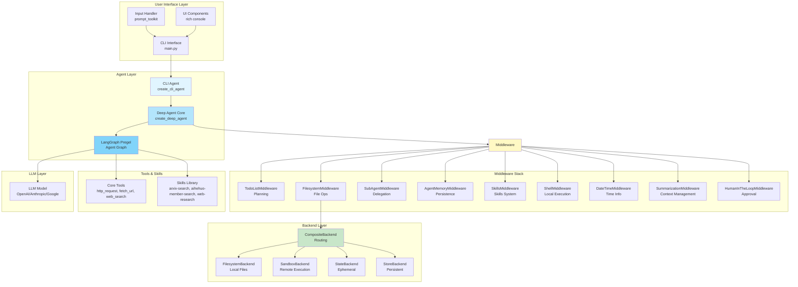
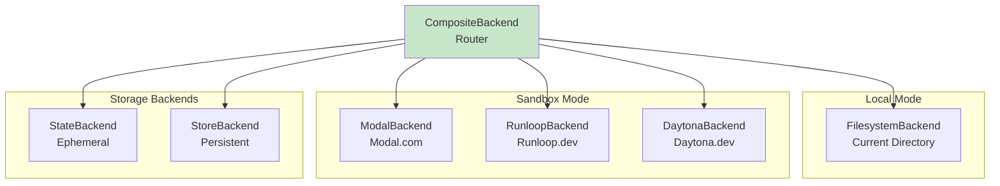
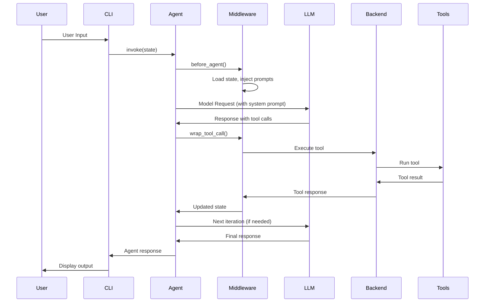
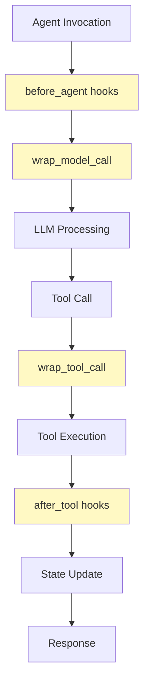
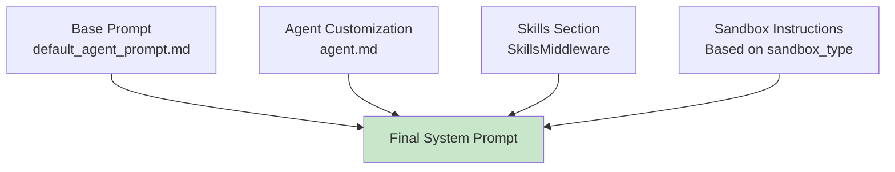
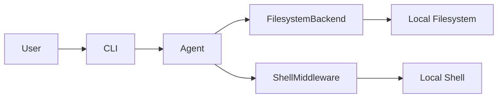
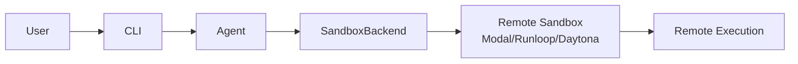

# DeepAgents CLI Architecture

## Overview

DeepAgents CLI is a sophisticated AI coding assistant built on LangGraph that combines multiple middleware components to provide a powerful, extensible agent framework. The architecture is designed around composable middleware, allowing flexible agent configurations for different use cases.

## High-Level Architecture



## Component Layers

### 1. User Interface Layer

**Components:**
- `main.py`: Entry point, CLI loop, command parsing
- `input.py`: Interactive prompt session (prompt_toolkit)
- `ui.py`: Rich console output, token tracking, help system
- `commands.py`: Slash commands (`/help`, `/exit`, etc.)

**Responsibilities:**
- Parse command-line arguments
- Manage interactive CLI session
- Handle user input/output
- Display agent responses and status

### 2. Agent Creation Layer

**Components:**
- `agent.py`: `create_cli_agent()` - Main agent factory
- `deepagents/graph.py`: `create_deep_agent()` - Core agent factory

**Flow:**
```
CLI Args → create_cli_agent() → create_deep_agent() → LangGraph Pregel
```

**Key Functions:**
- `create_cli_agent()`: CLI-specific agent configuration
  - Sets up middleware stack (memory, skills, shell)
  - Configures backend (local vs sandbox)
  - Handles system prompt generation
  - Configures human-in-the-loop interrupts
  
- `create_deep_agent()`: Core agent factory
  - Applies default middleware (todo, filesystem, subagents)
  - Configures summarization and caching
  - Creates LangGraph state graph

### 3. Middleware System

Middleware components are executed in order, each extending the agent's capabilities:

#### Core Middleware (from `deepagents`)

```mermaid
graph LR
    A[User Request] --> B[TodoListMiddleware]
    B --> C[FilesystemMiddleware]
    C --> D[SubAgentMiddleware]
    D --> E[SummarizationMiddleware]
    E --> F[AnthropicPromptCachingMiddleware]
    F --> G[PatchToolCallsMiddleware]
    G --> H[LLM]
    H --> I[Response]
    
    style B fill:#fff9c4
    style C fill:#fff9c4
    style D fill:#fff9c4
```



**TodoListMiddleware**
- **Purpose**: Task planning and progress tracking
- **Tool**: `write_todos`
- **State**: `PlanningState` with `todos: list[Todo]`
- **System Prompt**: Injects todo management instructions

**FilesystemMiddleware**
- **Purpose**: File operations and context offloading
- **Tools**: `ls`, `read_file`, `write_file`, `edit_file`, `glob`, `grep`, `execute`
- **State**: `FilesystemState` with `files: dict`
- **Features**: Auto-evicts large results to filesystem

**SubAgentMiddleware**
- **Purpose**: Delegate tasks to isolated sub-agents
- **Tool**: `task` (for delegating to subagents)
- **Features**: Isolated context windows, custom models/tools per subagent

**DateTimeMiddleware**
- **Purpose**: Current date and time information
- **Tool**: `get_current_datetime`
- **Features**: Multiple format options (ISO, readable, custom)

#### CLI-Specific Middleware

**AgentMemoryMiddleware**
- **Purpose**: Persistent memory across sessions
- **Location**: `~/.deepagents/{agent_id}/`
- **Storage**: Agent state, conversation history, project memory
- **Features**: Automatic persistence, project context loading

**SkillsMiddleware**
- **Purpose**: Load and expose agent skills
- **Location**: 
  - User: `~/.deepagents/{agent_id}/skills/`
  - Project: `{project_root}/.deepagents/skills/`
- **Pattern**: Progressive disclosure (metadata in prompt, full docs in files)
- **Skills**: arxiv-search, aihehuo-member-search, web-research, etc.

**ShellMiddleware**
- **Purpose**: Local shell command execution
- **Mode**: Local mode only (not used in sandbox mode)
- **Features**: Workspace isolation, environment variable management

#### Utility Middleware

**SummarizationMiddleware**
- **Purpose**: Auto-summarize when context exceeds limits
- **Trigger**: Configurable (tokens or fraction)
- **Features**: Keeps recent messages, summarizes older ones

**HumanInTheLoopMiddleware**
- **Purpose**: Pause for human approval
- **Configuration**: `interrupt_on` dict mapping tool names to configs
- **Usage**: Prevents destructive operations without approval

**AnthropicPromptCachingMiddleware**
- **Purpose**: Cache system prompts (Anthropic models only)
- **Benefit**: Reduces API costs

**PatchToolCallsMiddleware**
- **Purpose**: Fix dangling tool calls from interruptions
- **Usage**: Automatic cleanup

### 4. Backend System

The backend system provides abstraction over file storage and execution:



**CompositeBackend**
- Routes file operations to appropriate backend
- Supports path-based routing (e.g., `/memories/` → StoreBackend)
- Default backend for unmatched paths

**FilesystemBackend**
- Local file system operations
- Used in local mode (default)

**Sandbox Backends**
- Remote execution environments
- Modal, Runloop, Daytona support
- Provides isolated execution environment

**Storage Backends**
- StateBackend: Ephemeral storage (in-memory)
- StoreBackend: Persistent storage (file-based or database)

### 5. Skills System

The skills system implements Anthropic's "Agent Skills" pattern:

```mermaid
graph TB
    SkillsMW[SkillsMiddleware]
    
    subgraph "Skill Discovery"
        Load[load.py<br/>list_skills]
        Parse[YAML Frontmatter<br/>Parsing]
        Meta[Skill Metadata<br/>name, description, path]
    end
    
    subgraph "Skill Storage"
        User[User Skills<br/>~/.deepagents/{agent}/skills/]
        Project[Project Skills<br/>.deepagents/skills/]
    end
    
    subgraph "Example Skills"
        Arxiv[arxiv-search<br/>Research Papers]
        Aihehuo[aihehuo-member-search<br/>Member Search]
        Web[web-research<br/>Web Research]
    end
    
    SkillsMW --> Load
    Load --> Parse
    Parse --> Meta
    Meta --> User
    Meta --> Project
    User --> Arxiv
    User --> Aihehuo
    User --> Web
    
    style SkillsMW fill:#fff9c4
    style User fill:#e1f5ff
    style Project fill:#e1f5ff
```

**Skill Structure:**
```
skill-name/
├── SKILL.md          # Required: YAML frontmatter + instructions
├── script.py         # Optional: Supporting scripts
└── config.json       # Optional: Configuration files
```

**Progressive Disclosure:**
1. Skills metadata (name, description) injected into system prompt
2. Agent discovers relevant skills from metadata
3. Agent reads full `SKILL.md` when skill is needed
4. Agent executes skill scripts or follows skill workflows

## Execution Flow

### Agent Invocation Flow



### Middleware Execution Order



**Middleware Execution Order:**
1. **before_agent()**: Load skills, initialize state
2. **wrap_model_call()**: Inject system prompts, modify requests
3. **wrap_tool_call()**: Intercept tool calls, add approval checks
4. **after_tool()**: Process tool results, update state

## Configuration System

### Settings Management

**Location**: `config.py`

**Key Components:**
- `Settings` class: Global settings and environment detection
- API key detection (OpenAI, Anthropic, Google, Tavily)
- Project root detection
- Agent directory management

**Environment Variables:**
- `OPENAI_API_KEY`: OpenAI models
- `ANTHROPIC_API_KEY`: Anthropic/Claude models
- `GOOGLE_API_KEY`: Google Gemini models
- `TAVILY_API_KEY`: Web search capability
- `AIHEHUO_API_KEY`: AI He Huo member search
- `AIHEHUO_API_BASE`: AI He Huo API base URL

### Agent Configuration

**Agent Directory Structure:**
```
~/.deepagents/
└── {agent_id}/
    ├── agent.md              # System prompt customization
    ├── skills/               # User-level skills
    │   ├── arxiv-search/
    │   └── aihehuo-member-search/
    └── memory/               # Persistent memory (if enabled)
```

**Project-Level Configuration:**
```
{project_root}/
└── .deepagents/
    └── skills/               # Project-specific skills
```

## System Prompt Generation

The system prompt is dynamically generated from multiple sources:



**Prompt Components:**
1. **Base Prompt**: Default coding instructions
2. **Agent Customization**: User-defined `agent.md` content
3. **Skills Section**: Available skills list (from SkillsMiddleware)
4. **Sandbox Instructions**: Remote execution context (if applicable)
5. **Todo Instructions**: Todo list management (from TodoListMiddleware)

## Tool System

### Core Tools

**HTTP Tools:**
- `http_request`: Generic HTTP requests
- `fetch_url`: Fetch web content
- `web_search`: Web search (requires Tavily API key)

### Middleware-Provided Tools

**FilesystemMiddleware:**
- `ls`, `read_file`, `write_file`, `edit_file`, `glob`, `grep`, `execute`

**TodoListMiddleware:**
- `write_todos`

**SubAgentMiddleware:**
- `task` (delegate to subagents)

**DateTimeMiddleware:**
- `get_current_datetime`

**ShellMiddleware:**
- Shell command execution (local mode only)

### Skills as Tools

Skills are not direct tools but provide workflows:
- Agent reads skill documentation
- Agent executes skill scripts
- Agent follows skill workflows

## State Management

### Agent State Schema

The agent state is extended by multiple middleware:

```python
class AgentState(TypedDict):
    messages: list[Message]  # Core conversation history
    
    # From TodoListMiddleware
    todos: list[Todo]  # Optional
    
    # From FilesystemMiddleware
    files: dict[str, str]  # Optional
    
    # From SkillsMiddleware
    skills_metadata: list[SkillMetadata]  # Optional
    
    # From AgentMemoryMiddleware
    project_memory: dict  # Optional
```

### State Persistence

**In-Memory**: Default (InMemorySaver)
- State persists during session
- Lost on agent restart

**Persistent**: AgentMemoryMiddleware
- Saves to `~/.deepagents/{agent_id}/memory/`
- Loads project context automatically
- Maintains conversation history

## CLI Modes

### Local Mode (Default)



**Features:**
- Direct file system access
- Local shell execution
- No remote dependencies

### Sandbox Mode



**Features:**
- Isolated execution environment
- Remote file system
- No local shell (uses sandbox execute tool)

## Error Handling & Interrupts

### Human-in-the-Loop

**Interrupt Configuration:**
```python
interrupt_on = {
    "write_file": True,      # Pause before writing files
    "execute": True,          # Pause before executing commands
    "edit_file": {"destructive": True},  # Conditional interrupts
}
```

**Auto-Approve Mode:**
- `--auto-approve` flag disables all interrupts
- Useful for automated workflows
- All tools execute without confirmation

## Extension Points

### Adding New Middleware

1. Create middleware class extending `AgentMiddleware`
2. Implement required hooks (`wrap_model_call`, `wrap_tool_call`, etc.)
3. Add to middleware stack in `create_cli_agent()`

### Adding New Skills

1. Create skill directory with `SKILL.md`
2. Add YAML frontmatter with name and description
3. Place in user or project skills directory
4. SkillsMiddleware automatically discovers and exposes

### Adding New Backends

1. Implement `BackendProtocol` or `SandboxBackendProtocol`
2. Register in `sandbox_factory.py`
3. Use via `--sandbox` CLI option

## Security Considerations

- **API Keys**: All stored in environment variables or `.env` files
- **Credentials**: Never hardcoded in source code
- **File Access**: Sandbox mode provides isolation
- **Tool Execution**: Human-in-the-loop prevents unauthorized actions

## Performance Optimizations

- **Prompt Caching**: AnthropicPromptCachingMiddleware reduces costs
- **Context Summarization**: SummarizationMiddleware manages token limits
- **Result Offloading**: FilesystemMiddleware evicts large results to disk
- **Lazy Skill Loading**: Progressive disclosure reduces prompt size

## Testing Architecture

**Test Structure:**
- Unit tests: Individual middleware components
- Integration tests: Full agent workflows
- Skill tests: Skill discovery and execution

**Test Patterns:**
- Mock LLM responses for predictable testing
- Real LLM tests for end-to-end validation
- Sandbox tests for remote execution validation

## Future Extensibility

The architecture supports:
- Additional middleware components
- New skill types and patterns
- Custom backend implementations
- Alternative LLM providers
- Enhanced state management strategies

---

## Summary

DeepAgents CLI is built on a modular, composable architecture that separates concerns into distinct layers:

1. **UI Layer**: User interaction and display
2. **Agent Layer**: Core agent logic and graph execution
3. **Middleware Layer**: Composable capability extensions
4. **Backend Layer**: Storage and execution abstraction
5. **Skills Layer**: Extensible domain-specific capabilities

This architecture enables:
- Flexible agent configurations
- Easy extension through middleware and skills
- Support for multiple execution environments
- Persistent memory and state management
- Human-in-the-loop safety controls

The system is designed to be both powerful for advanced users and simple for basic use cases, with sensible defaults and clear extension points.

